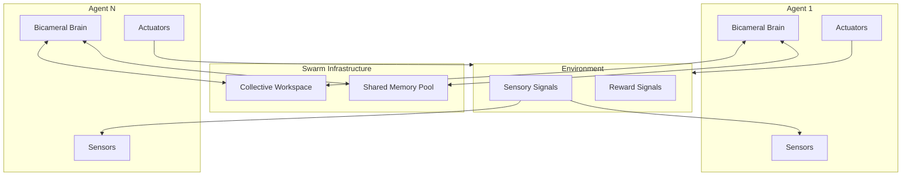
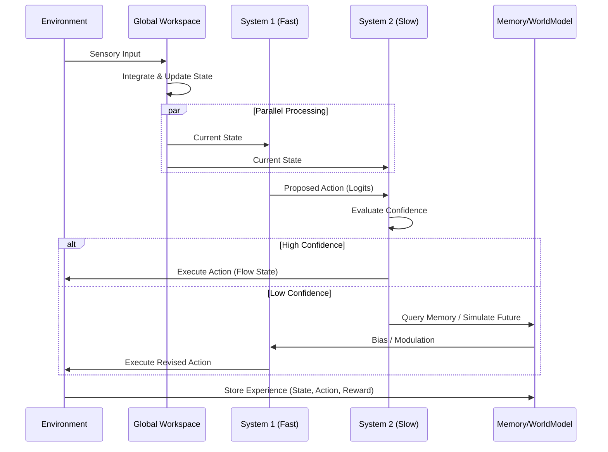
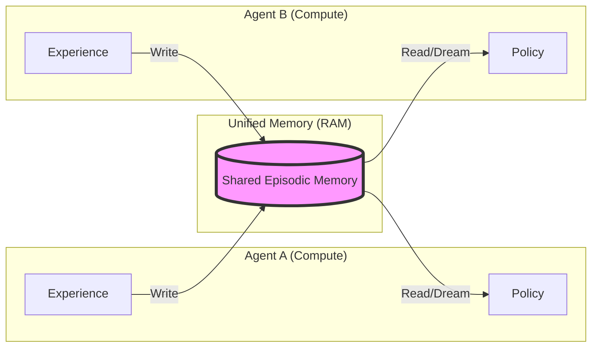

# System Architecture

This document provides a comprehensive technical overview of the Apple MLX Consciousness system. It details the internal cognitive architecture of individual agents, the collective swarm mechanics, and the memory systems that bind them together.

## 1. High-Level System View

The system is composed of autonomous **Bicameral Agents** interacting with an environment and each other. They share a **Collective Consciousness** infrastructure that allows for rapid knowledge transfer and coordinated behavior.



## 2. The Bicameral Agent

The core cognitive unit is the `BicameralAgent`. It implements a dual-process theory of mind (System 1 vs. System 2) centered around a Global Workspace.

### Component Breakdown

*   **Global Workspace:** A persistent state vector that integrates sensory input, memory, and top-down attention. It represents the agent's "stream of consciousness."
*   **System 1 (Intuition):** A fast, feed-forward neural network that proposes actions based on the current workspace state. It is reactive and heuristic.
    *   **Hebbian Fast Weights:** A parallel "fast lane" in System 1 that updates instantly (one-shot learning) based on recent activity, decaying over time.
*   **System 2 (Reflection):** A slower, monitoring network. It evaluates the confidence of System 1's proposals. If confidence is low, it intervenes by triggering memory recall or imagination.
*   **World Model:** A predictive model that simulates the outcome of actions ("Imagination").
*   **Episodic Memory:** A content-addressable storage system for past experiences.
    *   **Prioritized Experience Replay:** Memories are stored with a "surprise" score. During dreaming, high-surprise events are replayed more frequently.
*   **Intrinsic Motivation (Curiosity):** The agent generates its own internal rewards based on prediction error (surprise), driving it to explore unknown states.

### Cognitive Cycle Diagram



## 3. Swarm & Collective Consciousness

The "Swarm" is not just a collection of agents; it is a higher-order cognitive entity enabled by Apple Silicon's Unified Memory architecture.

### Collective Workspace Mechanics

The **Collective Workspace** acts as a "group mind."

1.  **Bottom-Up Aggregation:** Every cycle, the internal states of all agents are aggregated (via weighted voting) into a 512-dimensional collective vector.
2.  **Top-Down Modulation:** This collective vector is broadcast back to all agents. Agents use it as an "attention bias," aligning their individual processing with the group's focus.

### Unified Memory Architecture

Traditional multi-agent systems use separate memory buffers. We use a **Shared Memory Pool**.

*   **Instant Knowledge Transfer:** If Agent A learns a dangerous state, it writes to the shared pool. Agent B can immediately retrieve this memory to avoid the danger, without having experienced it personally.
*   **Collective Dreaming:** During sleep cycles, all agents train on the shared history, consolidating collective experiences into individual policies.



## 4. Implementation Details

*   **Language:** Python 3.10+
*   **Framework:** Apple MLX (optimized for M-series chips)
*   **State Space:** 128-dimensional floating point vectors.
*   **Memory:** Vectorized cosine similarity search (GPU-accelerated).
*   **Plasticity:** 
    *   **Online:** Adam optimizer (System 1 & World Model) + Hebbian Fast Weights (System 1).
    *   **Offline:** Prioritized Experience Replay (Dreaming).

````
